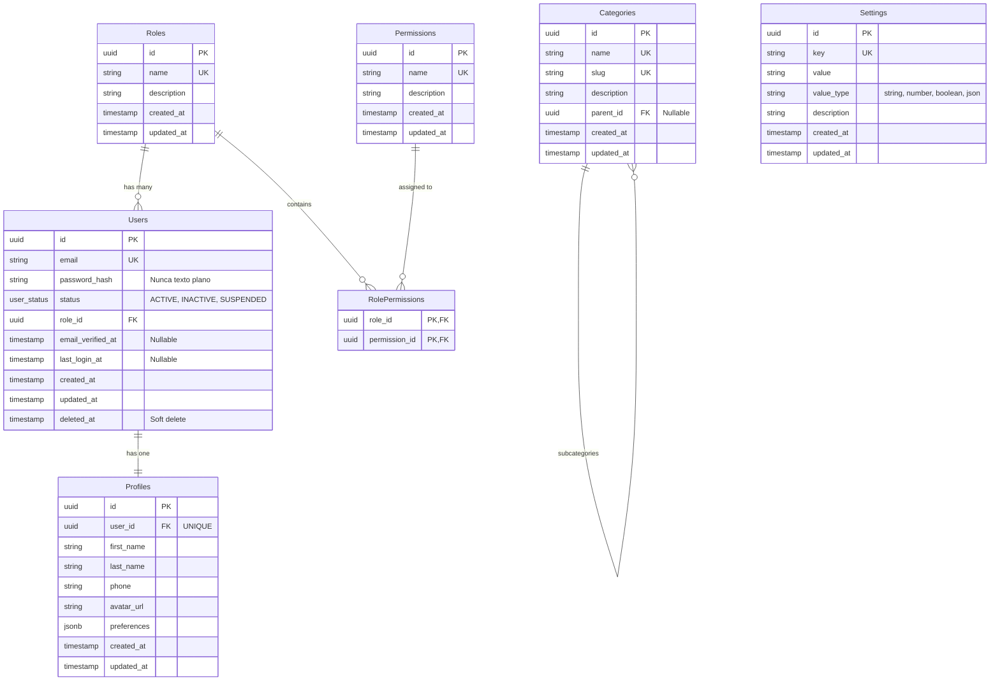

# 🗄️ Esquema de Base de Datos (Optimizado)

Este documento describe la estructura inicial de la base de datos relacional para la plataforma **MedioLike**.
*Nota: Este modelo ha sido optimizado aplicando estándares de la industria (Soft deletes, Timestamps de auditoría y variables seguras).*

## 📊 Diagrama Entidad-Relación (ER)

## 📖 Diccionario de Datos

### 1. `Users`
Almacena las credenciales de los usuarios con soporte de auditoría completa.
- `id` (UUID): Identificador único.
- `email` (String): Correo electrónico (único).
- `password_hash` (String): Contraseña encriptada por seguridad (Bcrypt/Argon2).
- `status` (Enum): Estado de la cuenta (`ACTIVE`, `INACTIVE`, `SUSPENDED`).
- `role_id` (UUID): Llave foránea hacia `Roles`.
- `email_verified_at`, `last_login_at` (Timestamp): Logs de seguridad.
- `created_at`, `updated_at`, `deleted_at`: Auditoría. *Soft delete* impide borrar usuarios físicamente de la BD para no romper métricas interrelacionadas.

### 2. `Roles`
Niveles de acceso del sistema (Ej. Admin, Instructor, Participante).
*(Campos estándar: id, name, description, timestamps)*

### 3. `Permissions`
Catálogo de acciones específicas (Ej. `CREATE_COURSE`).
*(Campos estándar: id, name, description, timestamps)*

### 4. `RolePermissions`
Relación muchos-a-muchos (Un Rol contiene múltiples Permisos).

### 5. `Profiles`
Datos personales no críticos. Separados de `Users` para tener una tabla de autenticación más limpia y rápida.

### 6. `Categories`
Listado jerárquico de categorías para cursos.
- `slug` (String): URL amigable única para la web (ej. `rutas/programacion-web`).
- `parent_id` (UUID): Permite sub-categorías de nivel infinito.

### 7. `Settings`
Almacenamiento de valores dinámicos.
- `key` (String): Identificador.
- `value` (String): Contenido de configuración.
- `value_type` (String): Tipo de valor para validarlo del lado del Frontend (`string`, `number`, `boolean`, `json`).
